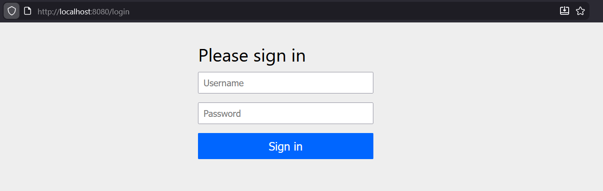
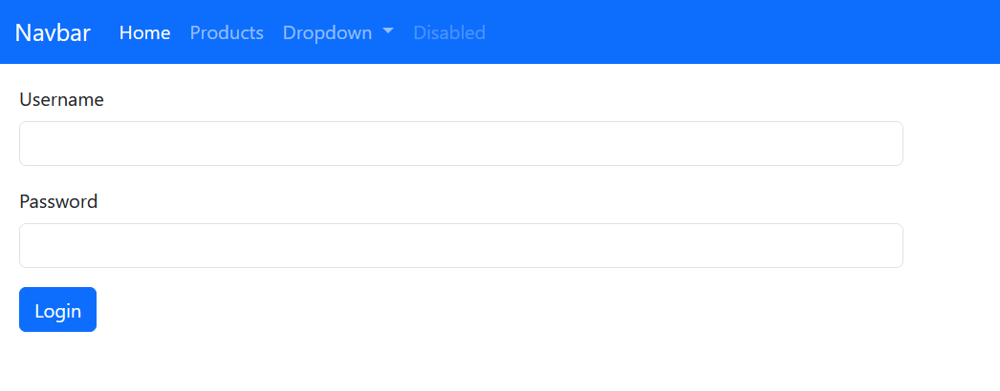

# Activité Pratique N°2 : Spring MVC - Spring Data JPA, Hibernate

---
## Consigne
Créer une application Web JEE basée sur Spring, Spring Data JPA, Hibernate, Tymeleaf et Spring Security qui permet de gérer des produits :
- Vidéo à suivre :  https://www.youtube.com/watch?v=FHy7raIldgg

---

## 1 - Créeation d'entité JPA Product
Au premier on créer les packages entities,repository et web.
<br/> Puis créer la classe Product
```java
@Entity
@NoArgsConstructor
@AllArgsConstructor
@Getter
@Setter
@ToString
@Builder
public class Product {
    @Id @GeneratedValue
    private Long id;
    @NotEmpty
    @Size(min = 3, max = 50)
    private String name;
    @Min(0)
    private double price;
    @Min(1)
    private double quantity;
}
```
@Size et @Min sont des notation de la dependance validation.
<br/> Puis on créer la classe ProductRepository dans la package repository
```java
public interface ProductRepository extends JpaRepository<Product, Long> {}
```
 <br/>Puis on ajoute un bean au fichier GlsidEnsetSpringMvcApplication
 ```java
@Bean
    public CommandLineRunner start(ProductRepository productRepository){
        return args -> {
            productRepository.save(Product.builder()
                    .name("Computer")
                    .price(5400)
                    .quantity(12)
                    .build());
            productRepository.save(Product.builder()
                    .name("Printer")
                    .price(1200)
                    .quantity(11)
                    .build());
            productRepository.save(Product.builder()
                    .name("Smart phone")
                    .price(1200)
                    .quantity(33)
                    .build());
            productRepository.findAll().forEach(p -> {
                System.out.println(p.toString());
            });
        };
    }
```
<br/> Pour créer la base de donner et la connexion on mise a jour le fichier
repository/ProductRepository

```properties
spring.application.name=glsid-enset-spring-mvc
spring.datasource.url=jdbc:h2:mem:products-db
spring.datasource.username=sa
spring.datasource.password=
spring.jpa.hibernate.ddl-auto=update
#not Create
server.port=8080
spring.h2.console.enabled=true

```
On faire la mise a jour de pom.xml dans la dependance et groupId lombok on ajoute la version
```xml
<version>1.18.38</version>
```
Pour voir de h2 dashboard:
```link
http://localhost:8080/h2-console
```
## Désactivation la protection par défaut de spring security
### 1 - L'affichage
Remarque : user : user et password : generated security password dans le console
</br> Pour désactiver spring security dans la classe GlsidEnsetSpringMvcApplication
```java
@SpringBootApplication(exclude = {SecurityAutoConfiguration.class})
```

il assure de ne pas utiliser les depandances de spring security au démarage.
et de n'est pas requis login et mot de pass apres l'acces au http://localhost:8080/h2-console
</br> on pass a la partie web
<br/>
## Créatation le contrôleur spring MVC et les vues thymeleaf
On créer le controller la classe ProductController dans la package web
```java
@Controller
public class ProductController {
    @Autowired
    private ProductRepository productRepository;
    @GetMapping("/index")
    public String index() {
        return "products";
    }
}
```
se code pour tester dit que si on entrer le lien /index il va appler la page products qui va dans le dossier
ressources/templates (since we are using teamleaf)
puis le view une page html dans ressources/templates products.html
```html
<!DOCTYPE html>
<html lang="en">
<head>
    <meta charset="UTF-8">
    <title>Products</title>
</head>
<body>
<h1>test</h1>
</body>
</html>
```

</br>
puis on ajoute un model au controlleur pour stocker les produit et utlise la list dans le view
```java
@Controller
public class ProductController {
    @Autowired
    private ProductRepository productRepository;
    @GetMapping("/index")
    public String index(Model model) {
        List<Product> products = productRepository.findAll();
        model.addAttribute("productList", products);
        return "products";
    }
}
```
et on mise a jour le fichier products.html on utilisant thymeleaf et l'attribut 
de module prductList:
```html
<!DOCTYPE html>
<html lang="en" xmlns:th="http://www.thymeleaf.org">
<head>
    <meta charset="UTF-8">
    <title>Products</title>
</head>
<body>
<table>
    <thead>
    <th>ID</th><th>Name</th><th>Price</th><th>Quantity</th>
    </thead>
    <tbody>
    <tr th:each="p:${productList}">
        <td th:text="${p.id}"></td>
        <td th:text="${p.name}"></td>
        <td th:text="${p.price}"></td>
        <td th:text="${p.quantity}"></td>
    </tr>
    </tbody>
</table>
</body>
</html>
```

</br>
Pour mieux presentation on utilise bootstrap
</br>
webjars bootstrap 5 maven dependency

```link
https://mvnrepository.com/artifact/org.webjars/bootstrap
```
et copie la depandance au pom.xml, et actualiser
```xml
<!-- Source: https://mvnrepository.com/artifact/org.webjars/bootstrap -->
<dependency>
    <groupId>org.webjars</groupId>
    <artifactId>bootstrap</artifactId>
    <version>5.3.8</version>
    <scope>compile</scope>
</dependency>
```
Puis on mise a jour le fichier html
```html
<!DOCTYPE html>
<html lang="en" xmlns:th="http://www.thymeleaf.org">
<head>
    <meta charset="UTF-8">
    <title>Products</title>
    <link rel="stylesheet" type="text/css" href="/webjars/bootstrap/5.3.8/css/bootstrap.min.css">
</head>
<body>
<div class="p-3">
    <table class="table">
        <thead>
        <th>ID</th><th>Name</th><th>Price</th><th>Quantity</th>
        </thead>
        <tbody>
        <tr th:each="p:${productList}">
            <td th:text="${p.id}"></td>
            <td th:text="${p.name}"></td>
            <td th:text="${p.price}"></td>
            <td th:text="${p.quantity}"></td>
        </tr>
        </tbody>
    </table>
</div>
</body>
</html>
```


### Supression :
On mise a jour le fichier `products.html` par ajouter la button (le lien) de supression.
```html
<td>
    <a class="btn btn-danger" onclick="return confirm('Etes vous sure?')" th:href="@{/delete(id=${p.id})}">delete</a>
</td>
```
Puis on ajoute la methode dans le controlleur `ProductController.java`
```java
@GetMapping("/delete")
public String delete(@RequestParam(name = "id") Long id) {
    productRepository.deleteById(id);
    return "redirect:/index";
}
```
*Remarque* : tu peut faire directement `Long id` mais il est preferable de utilise `@RequestParam`
si tu utilise des parametre dans le lien.
## Page template basée sur Thymeleaf layout et bootstrap
Dans cette section on va ajouter une template.</br>
Une page template est la partie qui ne change pas dans tout les pages de l'application, comme `header` et `footer`.</br>
**1er :**  en ajoute la dependace de temleaf layout.
```xml
<dependency>
    <groupId>nz.net.ultraq.thymeleaf</groupId>
    <artifactId>thymeleaf-layout-dialect</artifactId>
</dependency>
```
**2eme :** en créer le fichier `ressources/templates/layout1.html`. </br>
**3eme :** on ajoute les fragments dans la page products.html
```html
<html lang="en" xmlns:th="http://www.thymeleaf.org"
      xmlns:layout="http://www.ultraq.net.nz/thymeleaf/layout"
      layout:decorate="layout1"
>...</html>
<div class="p-3" layout:fragment="content1"> ... </div>
```
**4eme :** On ajoute la methode home dans le fichier `ProductController.java`.
```java
@GetMapping("/home")
public String home() {
    return "redirect:/index";
}
```
### La saisir et l'ajoute d'un produit avec la validation du formulaire
Dans cette section on va créer la page d'ajoute des produits.</br>
**1er :** on ajoute la button `new product` dans la page `products.html`.
```html
<div class="p-3">
    <a class="btn btn-primary" th:href="@{/newProduct}">New Product</a>
</div>
```
**2eme :** On ajoutons la methode `newProduct` dans le controlleur `ProductController.java`.
```java
@GetMapping("/newProduct")
public String newProduct(Model model) {
        model.addAttribute("product", new Product());
        return "new-product";
}
```
**3eme :** On créer la page `new-product.html`.</br>
**4eme :** On ajoute la méthode `savePoroduct` dans le controlleur `ProductController.java`.
```java
@GetMapping("/saveProduct")
public String saveProduct (@Valid Product product, BindingResult bindingResult, Model model) {
    if(bindingResult.hasErrors()) return "new-product";
    productRepository.save(product);
    return "redirect:/newProduct";
}
```
**Remarque :** `@Valid` permet de respecter les contraintes qui déja défini dans la class Product, comme
```java
@NotEmpty
@Size(min = 3, max = 50)
```
(`Model model` required for `@Valid` to work), et `BindingResult bindingResult` est le variable ou l'erreur va stocker.</br>

## Sécuriser l'application avec Spring Security
Spring sécurité besoin des dépendance dans le fichier `pom.xml`.</br>
**1er :** On activer le spring sécurité. on suppremer le ligne qu'on a ajoute dans les premier parties dans le fichier
`GlsidEnsetSpringMvcApplication.java`.
```java
//@SpringBootApplication(exclude = {SecurityAutoConfiguration.class})
```
lorsque tu active la sécurité, une page de sécurité par défaut.</br>

</br> **le mot de pass** : est afficher dans le console. </br>
**Utilisateur** : user </br>
**2eme :** : on créer une classe : `sec.SecurityConfig`, et ajouter une fonction public `InMemoryUserDetailsManager`. </br>
`InMemoryUserDetailsManager` : est une strategie qui permet d'indiquer a spring que les utilsateur qui on le droit d'acces aux applications sont 
stocker au mémoire, et spécifier les utilisateur qu'on le droit d'acceder au l'application. </br>
puis on ajoute les utilisateurs.
```java
User.withUsername("user1").password("1234").roles("USER").build(),
User.withUsername("admin").password("1234").roles("USER","ADMIN").build()
```
ca s'apple la strategien on memory authentification. </br>
**3eme :** ajouter la methode qui va defini tous qui est necessite l'authentification (c-a-d les pages necessite l'auth et ce qu'on pas).
```java
@Bean
public SecurityFilterChain securityFilterChain(HttpSecurity http) throws Exception{
    return http
            .formLogin(Customizer.withDefaults()) // la formule par défaut de spring boot sécurité.
            .authorizeHttpRequests(ar->ar.anyRequest().authenticated()) // tous les requéte necéssite une authentification.
            .build();
}
```
**Remarque :** </br>
`.formLogin(Customizer.withDefaults())` indiquer que l'application va utiliser la page login par défaut de sécurité. </br>
Si tu a ton propre formulaire de login : </br>
`.formLogin(fl->fl.loginPage("/login").permitAll())` </br>
**4eme :** on ajoutons la fonction de hashage, et ajouter l'objet `encoder` dans la fonction `InMemoryUserDetailsManager`. </br>
**5eme :** On ajoutons la bouton de logout (logout is already defined in Spring boot security). </br>
```html
<li><a class="dropdown-item" th:href="@{/logout}">logout</a></li>
```
## 7 - Sécurisation d'application avec Spring Security
Pour utiliser  la securité dans layout on ajoute cette linge dans le fichier `layout1.html`dans la balise
`<html>`.
```html
      xmlns:sec="http://www.thymeleaf.org/extras/spring-security"
```
et pout afficher le nom d'utilisateur dans le navbar:
```html
<a class="nav-link dropdown-toggle" href="#" id="navbarDropdown2" role="button" data-bs-toggle="dropdown" aria-expanded="false">
    <span sec:authentication="name"></span>
</a>
```
Pour gérer les pages inaccessible pour les utilsateurs on ajoute l'élément html dans le fichier `SecurityConfig.java`
```java
.exceptionHandling(eh->eh.accessDeniedPage("/notAuthorized"))
```
c-a-d si un utilisateur essayet de entrer une page restricted, au lie de entrer la page resstricted de browser 
on creer notre ropre page /notAuthorized.\n
puis on ajoute la fichier `notAuthrzed.html` dans ressources/templates.
```html
<!DOCTYPE html>
<html lang="en" xmlns:th="http://www.thymeleaf.org"
      xmlns:layout="http://www.ultraq.net.nz/thymeleaf/layout"
      layout:decorate="layout1"
>
<head>
    <meta charset="UTF-8">
    <title>Products</title>
</head>
<body>
<div class="p-3" layout:fragment="content1">
    <h3 class="text-danger">Not Authorized</h3>
</div>
</body>
</html>
```
et on mettre a jour le controlleur de produit
```java
@GetMapping("/notAuthorized")
    public String notAuthorized() {
        return "notAuthorized";
    }
```
pour désactiver la button de supprimer pour les normales utilisateur ajouter au `products.html` :
```html
// in the <html>
xmlns:sec="http://www.thymeleaf.org/extras/spring-security"
// and add a condtion in the buttoN
<div class="p-3" sec:authorize="hasRole('ADMIN')">
<td sec:authorize="hasRole('ADMIN')">
```
Pour securiser la button supprimer utilise post et csrf (qui ajoute un champ hidden a chaque formulaire avec token valeur). <br>
on change la methode `get` pour delete au `delete` dans `ProductController`
```java
@PostMapping("/admin/delete")
```
et changer la button de `delete` par un formulaire et pas un lien.
```html
<td sec:authorize="hasRole('ADMIN')">
    <form action="post" th:action="@{/admin/delete(id=${p.id})}">
        <button type="submit" class="btn btn-danger"></button>
    </form>
</td>
```
csrf utilise par defaut, il ajoute un champ hidden au toute les formulaires qui a la valeur d'un tokken.
<br>
### Creation de login personnaliser
changer le fichier `SecurityConfig.java`
```java
// This
.formLogin(Customizer.withDefaults())
// To this
.formLogin(fl->fl.loginPage("/login"))
```
et ajoute dans `ProductContoller.java`
```java
@GetMapping("/login")
    public String login() {
        return "login";
    }
```
et puis créer la page html login.<br>
puis autoriser la page par changer `SecurityConfig.java`
```java
.formLogin(fl->fl.loginPage("/login").permitAll()) //ajoutons permitAll()
```
`remarque` : ajouter aussi les webjars au permitAll pour load bootstrap
```java
.authorizeHttpRequests(ar->ar.requestMatchers("/public/**", "/webjars/**").permitAll())
```

Puis on ajoute logout, on ajouter dans le controleur
```java
@GetMapping("/logout")
    public String logout(HttpSession session) {
        session.invalidate();
        return "login";
    }
```

