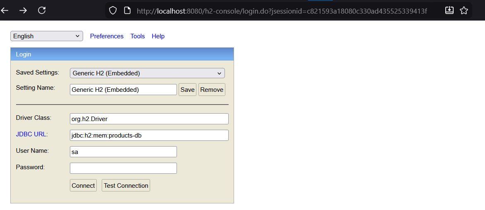
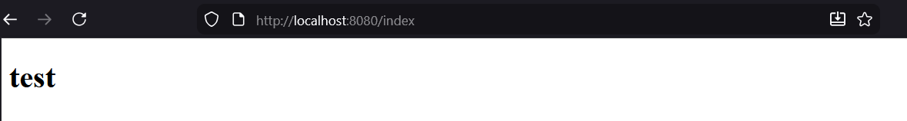
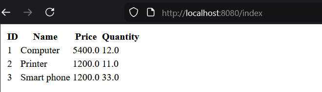
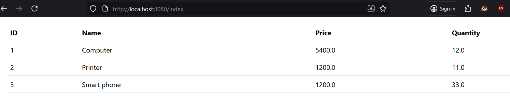

# Activité Pratique N°2 : Spring MVC - Spring Data JPA, Hibernate

---
## Consigne
Créer une application Web JEE basée sur Spring, Spring Data JPA, Hibernate, Tymeleaf et Spring Security qui permet de gérer des produits :
- Vidéo à suivre :  https://www.youtube.com/watch?v=FHy7raIldgg

---

## 1 - Créeation d'entité JPA Product
Au premier on créer les packages entities,repository et web.
<br/> Puis créer la classe Product
```java
@Entity
@NoArgsConstructor
@AllArgsConstructor
@Getter
@Setter
@ToString
@Builder
public class Product {
    @Id @GeneratedValue
    private Long id;
    @NotEmpty
    @Size(min = 3, max = 50)
    private String name;
    @Min(0)
    private double price;
    @Min(1)
    private double quantity;
}
```
@Size et @Min sont des notation de la dependance validation.
<br/> Puis on créer la classe ProductRepository dans la package repository
```java
public interface ProductRepository extends JpaRepository<Product, Long> {}
```
 <br/>Puis on ajoute un bean au fichier GlsidEnsetSpringMvcApplication
 ```java
@Bean
    public CommandLineRunner start(ProductRepository productRepository){
        return args -> {
            productRepository.save(Product.builder()
                    .name("Computer")
                    .price(5400)
                    .quantity(12)
                    .build());
            productRepository.save(Product.builder()
                    .name("Printer")
                    .price(1200)
                    .quantity(11)
                    .build());
            productRepository.save(Product.builder()
                    .name("Smart phone")
                    .price(1200)
                    .quantity(33)
                    .build());
            productRepository.findAll().forEach(p -> {
                System.out.println(p.toString());
            });
        };
    }
```
<br/> Pour créer la base de donner et la connexion on mise a jour le fichier
repository/ProductRepository

```properties
spring.application.name=glsid-enset-spring-mvc
spring.datasource.url=jdbc:h2:mem:products-db
spring.datasource.username=sa
spring.datasource.password=
spring.jpa.hibernate.ddl-auto=update
#not Create
server.port=8080
spring.h2.console.enabled=true

```
On faire la mise a jour de pom.xml dans la dependance et groupId lombok on ajoute la version
```xml
<version>1.18.38</version>
```
Pour voir de h2 dashboard:
```link
http://localhost:8080/h2-console
```
## Désactivation la protection par défaut de spring security
### 1 - L'affichage
Remarque : user : user et password : generated security password dans le console
</br> Pour désactiver spring security dans la classe GlsidEnsetSpringMvcApplication
```java
@SpringBootApplication(exclude = {SecurityAutoConfiguration.class})
```

il assure de ne pas utiliser les depandances de spring security au démarage.
et de n'est pas requis login et mot de pass apres l'acces au http://localhost:8080/h2-console
</br> on pass a la partie web
<br/>
## Créatation le contrôleur spring MVC et les vues thymeleaf
On créer le controller la classe ProductController dans la package web
```java
@Controller
public class ProductController {
    @Autowired
    private ProductRepository productRepository;
    @GetMapping("/index")
    public String index() {
        return "products";
    }
}
```
se code pour tester dit que si on entrer le lien /index il va appler la page products qui va dans le dossier
ressources/templates (since we are using teamleaf)
puis le view une page html dans ressources/templates products.html
```html
<!DOCTYPE html>
<html lang="en">
<head>
    <meta charset="UTF-8">
    <title>Products</title>
</head>
<body>
<h1>test</h1>
</body>
</html>
```

</br>
puis on ajoute un model au controlleur pour stocker les produit et utlise la list dans le view
```java
@Controller
public class ProductController {
    @Autowired
    private ProductRepository productRepository;
    @GetMapping("/index")
    public String index(Model model) {
        List<Product> products = productRepository.findAll();
        model.addAttribute("productList", products);
        return "products";
    }
}
```
et on mise a jour le fichier products.html on utilisant thymeleaf et l'attribut 
de module prductList:
```html
<!DOCTYPE html>
<html lang="en" xmlns:th="http://www.thymeleaf.org">
<head>
    <meta charset="UTF-8">
    <title>Products</title>
</head>
<body>
<table>
    <thead>
    <th>ID</th><th>Name</th><th>Price</th><th>Quantity</th>
    </thead>
    <tbody>
    <tr th:each="p:${productList}">
        <td th:text="${p.id}"></td>
        <td th:text="${p.name}"></td>
        <td th:text="${p.price}"></td>
        <td th:text="${p.quantity}"></td>
    </tr>
    </tbody>
</table>
</body>
</html>
```

</br>
Pour mieux presentation on utilise bootstrap
</br>
webjars bootstrap 5 maven dependency

```link
https://mvnrepository.com/artifact/org.webjars/bootstrap
```
et copie la depandance au pom.xml, et actualiser
```xml
<!-- Source: https://mvnrepository.com/artifact/org.webjars/bootstrap -->
<dependency>
    <groupId>org.webjars</groupId>
    <artifactId>bootstrap</artifactId>
    <version>5.3.8</version>
    <scope>compile</scope>
</dependency>
```
Puis on mise a jour le fichier html
```html
<!DOCTYPE html>
<html lang="en" xmlns:th="http://www.thymeleaf.org">
<head>
    <meta charset="UTF-8">
    <title>Products</title>
    <link rel="stylesheet" type="text/css" href="/webjars/bootstrap/5.3.8/css/bootstrap.min.css">
</head>
<body>
<div class="p-3">
    <table class="table">
        <thead>
        <th>ID</th><th>Name</th><th>Price</th><th>Quantity</th>
        </thead>
        <tbody>
        <tr th:each="p:${productList}">
            <td th:text="${p.id}"></td>
            <td th:text="${p.name}"></td>
            <td th:text="${p.price}"></td>
            <td th:text="${p.quantity}"></td>
        </tr>
        </tbody>
    </table>
</div>
</body>
</html>
```


### Supression :
On mise a jour le fichier `products.html` par ajouter la button (le lien) de supression.
```html
<td>
    <a class="btn btn-danger" onclick="return confirm('Etes vous sure?')" th:href="@{/delete(id=${p.id})}">delete</a>
</td>
```
Puis on ajoute la methode dans le controlleur `ProductController.java`
```java
@GetMapping("/delete")
public String delete(@RequestParam(name = "id") Long id) {
    productRepository.deleteById(id);
    return "redirect:/index";
}
```
*Remarque* : tu peut faire directement `Long id` mais il est preferable de utilise `@RequestParam`
si tu utilise des parametre dans le lien.
## Page template basée sur Thymeleaf layout et bootstrap


